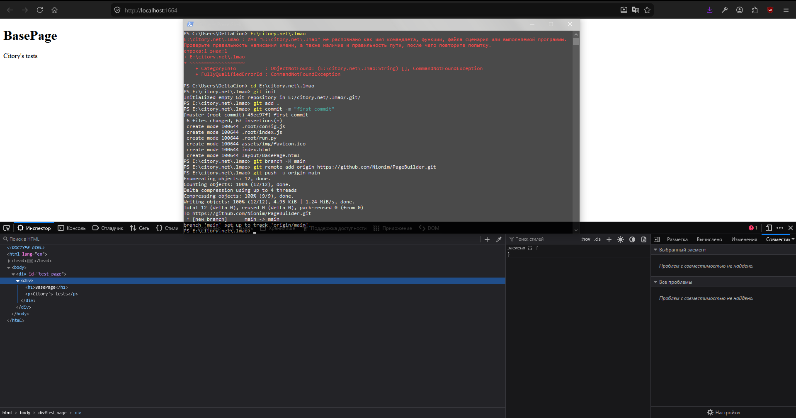

<h1> Work in progress </h1>

<!-- Lol json again -->
```json
    For load ur page in the <script> block u need to 
    loadHTML('$path/to_html.html', 'target_block_id');
    :D

    TODO: Auto reload all scripts after page load
    U cant use scripts in the custom blocks on this time

    TODO #2: Maybe need to compare all styles into one <style> block on page top. idk
```



<h3> Python webserver starter </h3>

```py
#   ./.root/run.py
import http.server
import socketserver

PORT = 1664
Handler = http.server.SimpleHTTPRequestHandler

with socketserver.TCPServer(("", PORT), Handler) as httpd:
    print(f"Server started on: http://localhost:{PORT}")
    httpd.serve_forever()
```

<h3> Config </h3>

```js
//  ./.root/config.js
export const pathAliases = {
    '$root':      './',
    '$assets':    './assets',
    '$layout':    './layout',
    '$img':     './assets/img',
    '$css':    './assets/css'
};
```

<h3> Main js script </h3>

```js
//  ./index.js
import { pathAliases } from '../config.js'

function resolveAlias(pathWithAlias) {
    for (const [alias, realPath] of Object.entries(pathAliases)) {
        if (pathWithAlias.startsWith(alias)) {
            return pathWithAlias.replace(alias, realPath);
        }
    }
    return pathWithAlias;
}

async function loadHTML(url, targetID) {
    const target = document.getElementById(targetID);
    if (!target) return;

    const pathLAYOUT = resolveAlias(url)
    try {
        const response = await fetch(pathLAYOUT);
        if (!response.ok) throw new Error(`HTTP ${response.status}`);
        const html = await response.text();

        target.innerHTML = html;
    } catch(error) {
        console.error(`Cannot found ${url}`, error);
    }
}

loadHTML('$layout/BasePage.html', 'test_page');
```